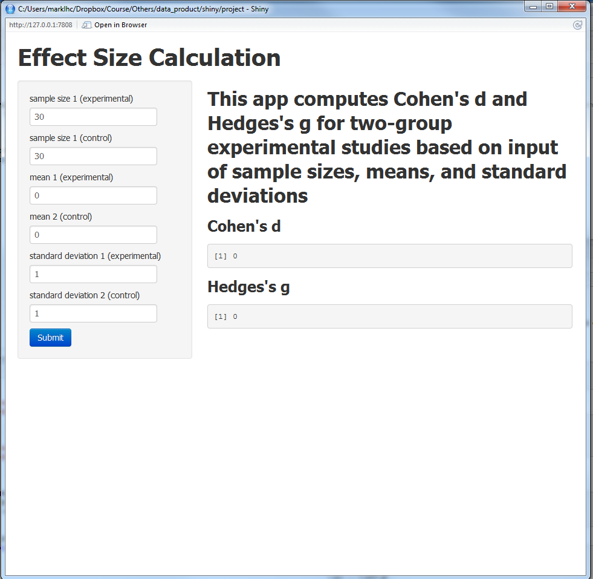

## What is effect size?

 - Whereas statistical significance helps us decide whether or not to reject a null hypothesis,
   effect size helps us quantify the efficacy of an intervention. 
 - For two-group experiments, Cohen's d and Hedges's g are two indices under the category 
   "standardized mean difference" commonly used by social scientists. 
 - ES = \frac{M_1 - M_2}{s}, 
 - s^2 = \frac{(N)1 - 1) SD_1^2 + (N_2 - 1) SD_2^2}{N_1 + N_2 - 2}. 
 (For some reason when I use Diplay LaTeX equations, the slide does not break
 correctly. So I just use the original code. )

---
   
## The Shiny app

<div style='text-align: center;'>
    
</div>

---

## Demo (Cohen's d)


```r
M1 <- 2
M2 <- 1
N1 <- 25
N2 <- 20
sd1 <- 1
sd2 <- 0.5

s2 <- ((N1 - 1) * sd1^2 + (N2 - 1) * sd2^2) / (N1 + N2 - 2)
cohen.d <- (M1 - M2) / sqrt(s2)
print(cohen.d)
```

```
## [1] 1.223
```

---

## Demo (Hedges's g)


```r
df <- N1 + N2 - 2
cm <- exp(lgamma(df / 2) - log(df / 2) / 2 - lgamma((df - 1) / 2))
hedges.g <- cohen.d * cm
print(hedges.g)
```

```
## [1] 1.201
```
